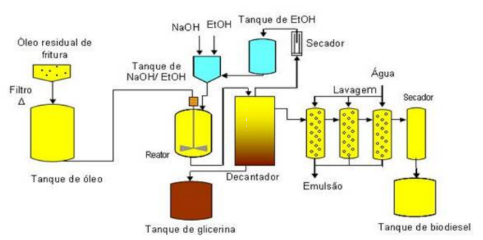

# Projeto SoA distribuído

O projeto consiste em fazer uma representação de uma planta de tratamento industrial. Abaixo segue uma imagem da planta.



## Arquitetura proposta

A arquitetura proposta consiste em desenvolver cada componente da planta como um serviço distinto e segregado dos restantes. Toda a comunicação entre os serviços se dá através de mensagens utilizando o broker de mensageria [ActiveMq](http://activemq.apache.org/).

## Pré-requisitos

- ActiveMq
- Java8 +
- Maven
- Docker - *opcional*

## Tecnologias utilizadas

- Java
- SpringBoot
- ActiveMq

## Execução

Você pode executar o ActiveMq de duas formas, a primeira é localmente com os fonte baixados direto do [site](https://activemq.apache.org/components/classic/download/), ou pode rodar localmente utilizando **Docker**.

### ActiveMq

Uma vez que tenha baixado o ActiveMq execute o script que se encontra na pasta `apache-activemq5-*/bin/activemq`.

- Executando em background
```bash
./activemq start
```

- Executando na console
```bash
./activemq console
```
Após o ActiveMq estiver iniciado, você poderá acessar a interface gráfica no endereço `0.0.0.0:8161`.

### ActiveMq utilizando Docker

Você também pode executar o ActiveMq em um container Docker.

```docker
docker run --name activemq --rm -it --hostname activemq -p 61616:61616 -p 8161:8161 rmohr/activemq
```

Após o ActiveMq estiver iniciado, você poderá acessar a interface gráfica no endereço `0.0.0.0:8161`.

### Executando os serviços

- Execute o script `init.sh` para compilar e empacotar os serviços;
- Abra cada pasta em um terminal diferente para executar paralelamente cada serviço
- Execute cada serviço
```Bash
java -jar <app>-1.0.0.jar
```

## Backlog

O objetivo inicial era rodar todos os serviços em container, por isso do arquivo `docker-compose.yaml`. Porém ainda não está funcional, fica apresentando erros de `host unreachable`.

Sendo assim ficar para V2 essa feature.
